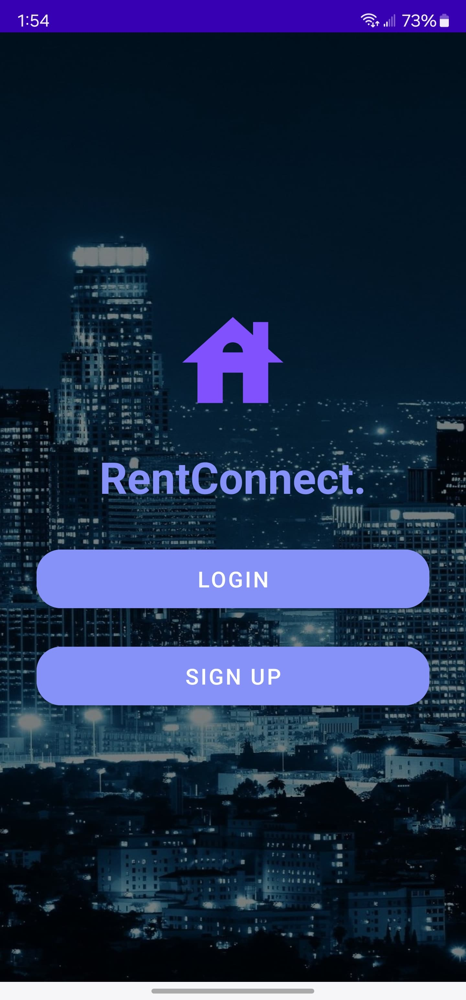
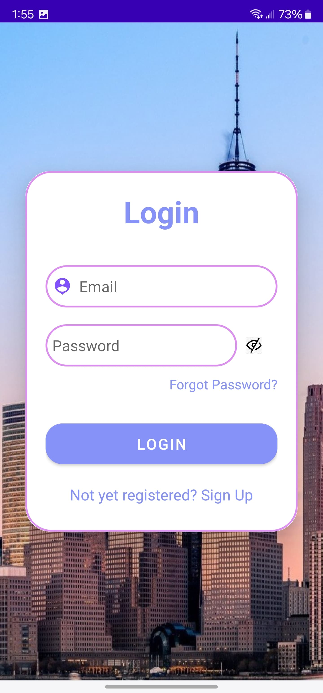
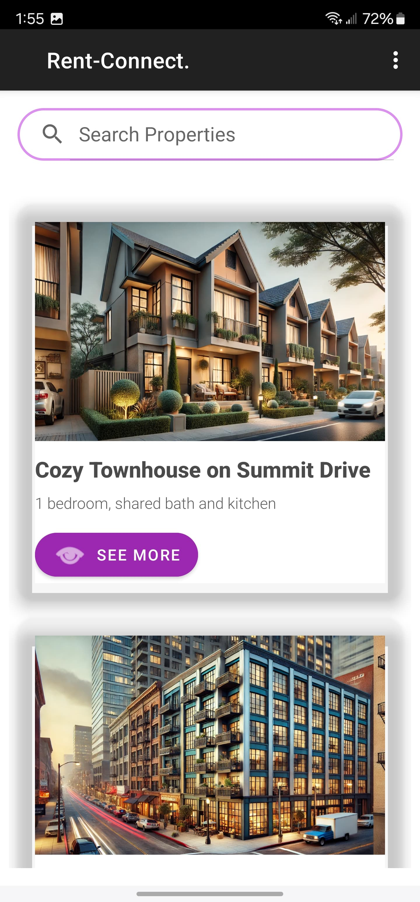
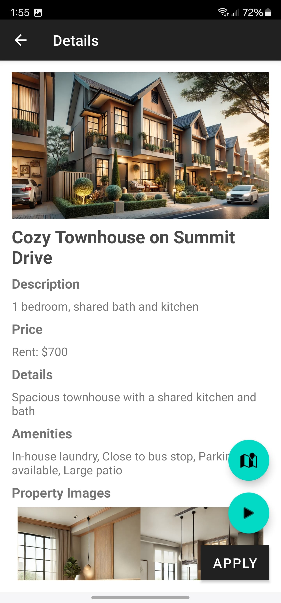
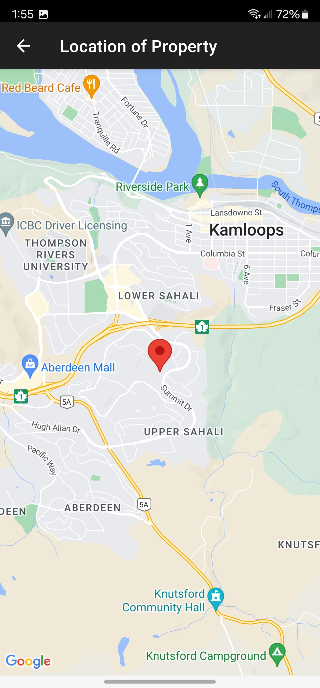
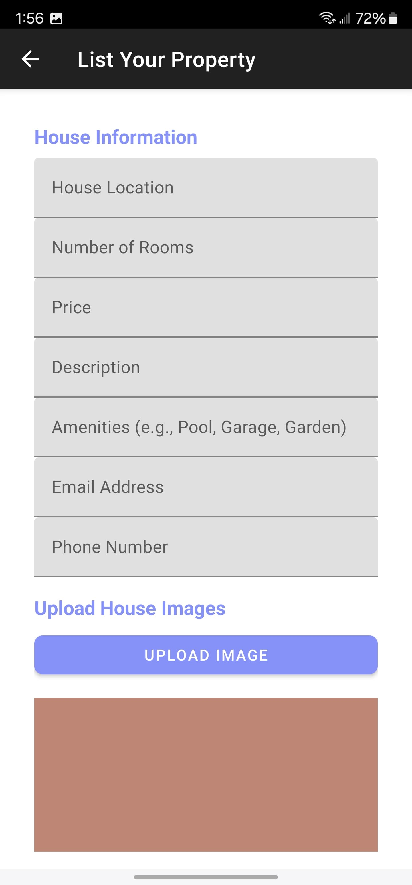

# Rent Connect App

The **Rent Connect App** is a mobile application designed to streamline the rental process between property owners and renters. Built for Android, the app simplifies searching, managing, and listing properties with a clean user interface and seamless performance.

---

## About the Project

This project was created to:
- Provide an efficient platform for renters to find available properties.
- Help property owners manage their listings and tenants effortlessly.
- Offer a mobile-first experience for real-time rental management.

---

## Features

- **Property Listings**:
  - View detailed property listings with images, descriptions, and pricing.
- **Search Functionality**:
  - Search for properties based on location, rent price, and amenities.
- **User Authentication**:
  - Secure login and registration for renters and property owners.
- **Responsive Design**:
  - Optimized for Android devices with an intuitive and clean interface.
- **Performance**:
  - Fast and lightweight with smooth navigation across app sections.

---

## Screenshots










---

## YouTube Demo

Watch the complete demo of the app in action:

[**YouTube Demo**](https://youtu.be/YOUR_YOUTUBE_LINK)

*(Replace `YOUR_YOUTUBE_LINK` with your actual YouTube video link.)*

---

## Google Play Store

Download the app directly from the Google Play Store:

[**Google Play Store**](https://play.google.com/store/apps/details?id=YOUR_APP_ID)

*(Replace `YOUR_APP_ID` with the actual Play Store ID of the app.)*

---

## Technologies Used

- **Kotlin** / **Java** (for Android Development)
- **XML** (for User Interface)
- **Firebase** (for Authentication and Database) *(if applicable)*
- **Android Studio** (IDE)

---

## How to Run the App

1. Clone the repository:
   ```bash
   git clone https://github.com/Raf1dhasan/RentConnect_App.git
2. Open the project in Android Studio.
3. Sync the project with Gradle files.
4. Build and run the app on an emulator or a connected Android device.

## What I Did
- Developed a fully functional Android app with property listing and search features.
- Implemented user authentication for property owners and renters.
- Designed a responsive and clean user interface to enhance user experience.
- Integrated search functionality to filter properties efficiently.

## What I Learned
- Improved my skills in Android development using Kotlin/Java.
- Gained experience working with responsive layouts and UI components.
- Learned how to integrate search filters and backend functionality.
- Enhanced my understanding of app deployment on the Google Play Store.

## Future Improvements
- Add a messaging feature for renters to communicate with property owners.
- Integrate a payment gateway for rent payments within the app.
- Implement notifications for new property listings and updates.
- Enhance search filters for amenities and property types.

## Contact
If you'd like to learn more about this project or discuss opportunities, feel free to reach out:

Email: rafidhasan202@gmail.com
